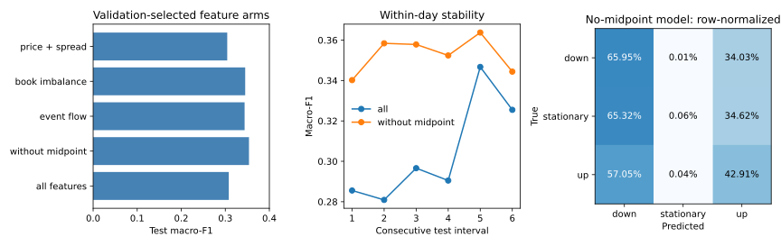

# AAPL public-sample baseline comparison

## Data and evaluation

The official LOBSTER AAPL level-10 sample covers 2012-06-21. We use the first five
book levels for features, a 100-event future midpoint target, and a zero return
threshold. There are 400,291 labeled observations: 200,827 down, 14,084 stationary,
and 185,380 up.

The chronological split has 240,174 training rows, 79,958 validation rows and 79,959
test rows, with 100-row gaps between intervals to avoid overlapping label horizons.
Both models select among three configurations using validation macro-F1, then refit
on the same train-plus-validation rows before one test evaluation. Logistic scaling
is refit only on those pre-test rows. Logistic regression uses balanced class weights;
the boosted model uses its default unweighted objective. This compares the stated
pipelines, not architecture alone.

## Measured results

| Method | Test macro-F1 | Test balanced accuracy |
|---|---:|---:|
| Majority class | 0.227316 | 0.333333 |
| Balanced logistic regression | 0.162659 | 0.349156 |
| Histogram gradient boosting | 0.317895 | 0.344253 |

Boosting improves macro-F1 by about 0.091 over the majority baseline. Logistic
regression has slightly higher balanced accuracy but lower macro-F1 than the
majority classifier. The metrics therefore do not support an unqualified claim that
one model is better on every criterion. Both balanced accuracies remain near 1/3.
Minority-class precision and temporal distribution shift deserve further analysis.

This is one sample day. Overlapping labels make rows dependent; no independent-row
confidence interval or cross-day significance claim is reported. There is no
demonstrated trading profit, and the deep model has not been evaluated in this table.

## Feature ablation and per-class diagnostics

This is an exploratory follow-up on the same sample and outer split. Each of five
feature groups chooses among the same three configurations using validation macro-F1.
All arms disable sklearn's automatic early stopping, which otherwise creates a random
internal validation subset on a large training set. The original baseline table above
is preserved and is not directly interchangeable with this follow-up.

| Group | Test macro-F1 |
|---|---:|
| Absolute midpoint + spread | 0.304369 |
| Spread + queue/microprice/depth imbalance | 0.345132 |
| Spread + resting-side event size + OFI | 0.343785 |
| All except absolute midpoint | 0.353726 |
| All features | 0.307873 |

All-minus-without-midpoint macro-F1 is −0.045854. Paired non-overlapping event-block
bootstrap 95% intervals are [−0.062493, −0.029602] for 1,000-event blocks and
[−0.067185, −0.024739] for 5,000-event blocks (2,000 resamples, seed 2026).
Both block choices support removing absolute midpoint on this interval. They do not
establish cross-day significance or a causal explanation of the feature's weakness.

For the no-midpoint model, the held-out confusion counts are:

| True / predicted | Down | Stationary | Up |
|---|---:|---:|---:|
| Down | 27285 | 6 | 14079 |
| Stationary | 2294 | 2 | 1216 |
| Up | 20011 | 15 | 15051 |

Stationary recall is just 0.000569 (roughly 0.057%). Macro-F1 alone would hide this
failure: the model largely distinguishes up/down and misses the rare stationary class.
The raw artifact reports precision, recall, prediction counts and six consecutive
chronological test intervals for every feature group. No group is chosen by test
score and presented as a newly untouched final test.



## Reproduce

```bash
pip install -e ".[dev,ml]"
python scripts/download_lobster_public_data.py
OMP_NUM_THREADS=1 MKL_NUM_THREADS=1 python scripts/run_logistic_baseline.py data/raw/aapl_level10/AAPL_2012-06-21_34200000_57600000_message_10.csv data/raw/aapl_level10/AAPL_2012-06-21_34200000_57600000_orderbook_10.csv --output results/published/aapl_logistic_matched.json
OMP_NUM_THREADS=1 MKL_NUM_THREADS=1 python scripts/run_gradient_boosted_baseline.py data/raw/aapl_level10/AAPL_2012-06-21_34200000_57600000_message_10.csv data/raw/aapl_level10/AAPL_2012-06-21_34200000_57600000_orderbook_10.csv --output results/published/aapl_boosted_matched.json
python -m pip install -e ".[plots]"
python scripts/plot_ablation.py
pytest -q
```

`results/published/environment.json` records package versions, thread limits and
SHA-256 hashes of both input files. The paired baseline workflow runs both scripts.
Version changes can alter histogram boosting slightly; use the recorded environment
for comparison. Original GitHub Actions output from
[run 37565178792](https://github.com/RyanBalech/limit-order-book-research/actions/runs/37565178792)
at commit `94a418071f39ccf7ec64a172d4b8b83e68002fc1` is preserved separately as
`aapl_level10_gradient_boosted.json` (macro-F1 0.320103).

Next steps: multiple independent days, walk-forward evaluation, stationary-class threshold/calibration
analysis, DeepLOB-style comparisons, and block/day-level uncertainty before any
economic interpretation.
